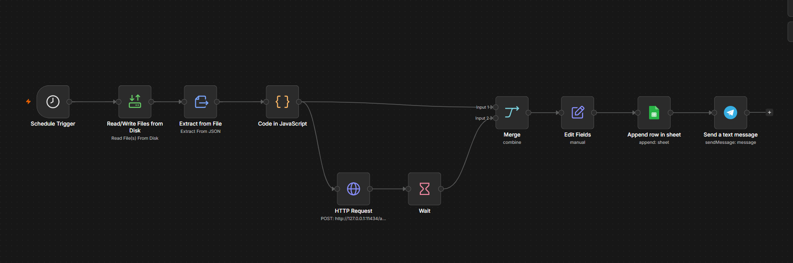
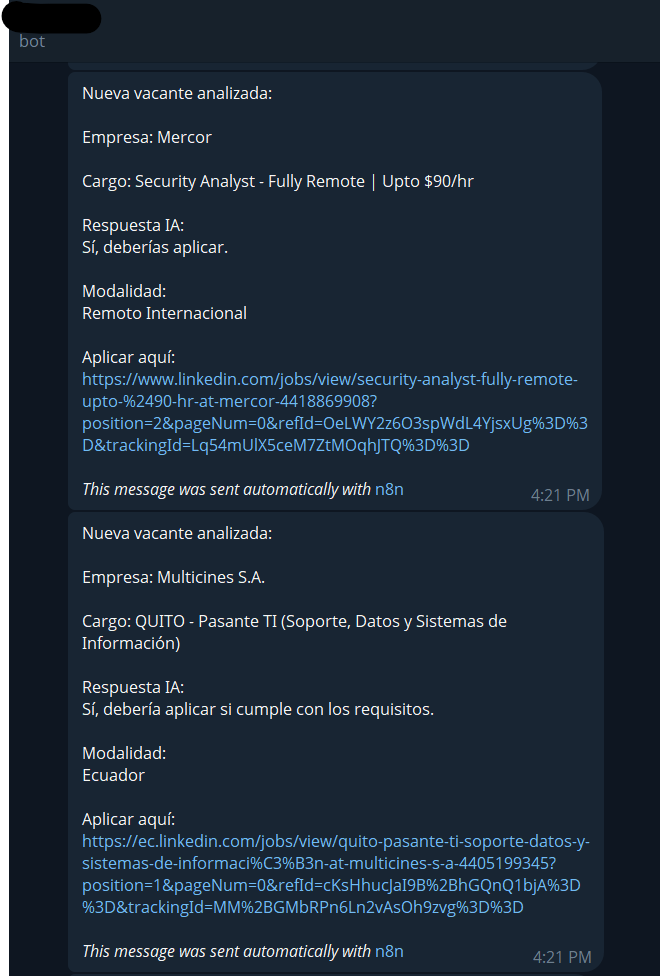
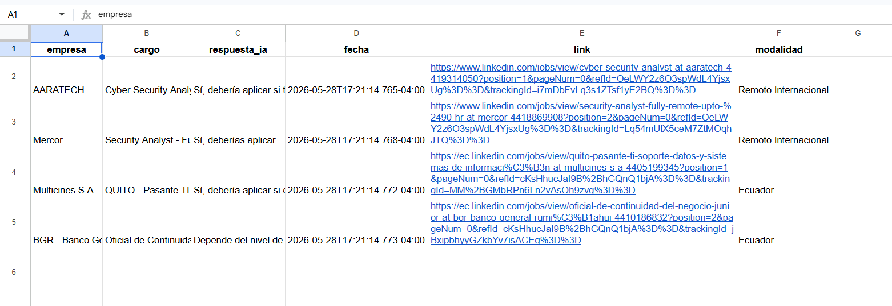

# AI Cybersecurity Job Agent

Agente de IA automatizado para búsqueda y análisis de vacantes de ciberseguridad utilizando Ollama, Playwright, n8n, Telegram y Google Sheets.

---

# Descripción

Este proyecto automatiza la búsqueda de vacantes relacionadas con ciberseguridad desde LinkedIn, analiza si las ofertas son adecuadas para un perfil junior utilizando IA local con Ollama y envía los resultados automáticamente a Telegram y Google Sheets.

El sistema fue diseñado para funcionar completamente de manera automática sin utilizar APIs pagadas ni consumo de tokens externos.

---

# Funcionalidades

- Scraping automatizado de vacantes desde LinkedIn
- Filtrado de trabajos remotos internacionales
- Búsqueda de vacantes presenciales en Ecuador
- Análisis de compatibilidad utilizando IA local con Ollama
- Comparación básica entre vacantes y CV
- Notificaciones automáticas por Telegram
- Registro automático en Google Sheets
- Automatización mediante n8n
- Ejecución programada con Windows Task Scheduler

---

# Tecnologías utilizadas

- Node.js
- Playwright
- Ollama
- n8n
- Telegram Bot API
- Google Sheets API
- Windows Task Scheduler

---

# Arquitectura del flujo

LinkedIn Scraper → jobs.json → n8n → Ollama → Telegram + Google Sheets

## Instalación

```bash
npm install
npx playwright install


---

## 5. Cómo ejecutar

```md id="r5"
## Ejecutar

```bash
node linkedin.js

## 6. Screenshots

## Workflow n8n



## Telegram Bot



## Google Sheets

